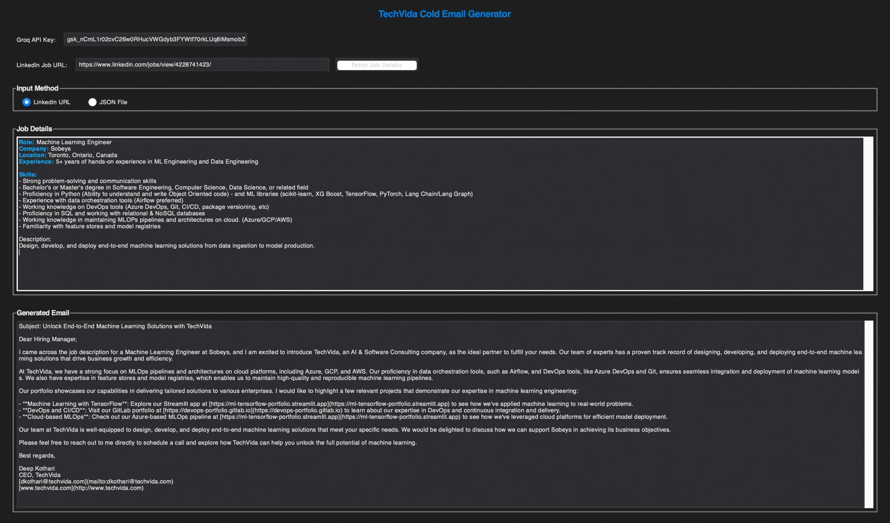
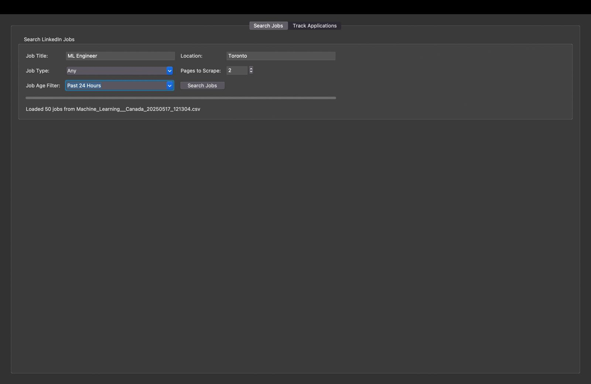
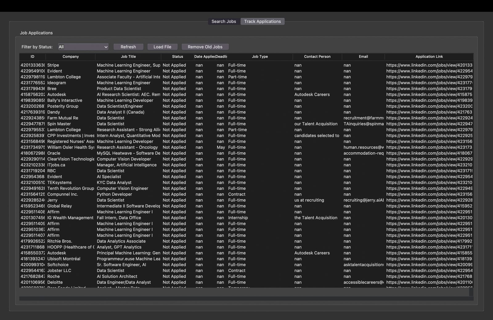
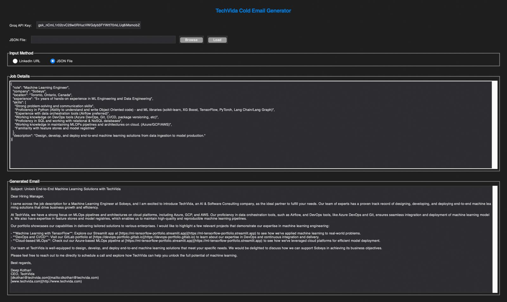

### Gen_AI_Llama3.1_VectorDB_Bidding_Tool

A comprehensive AI-powered tool for job seekers that automates client searching, tracking, and personalized cold email generation using Large Language Models and vector databases.


## Table of Contents

- [Overview](#overview)
- [Features](#features)
- [System Architecture](#system-architecture)
- [Technologies Used](#technologies-used)
- [Installation](#installation)
- [Usage](#usage)
- [Components](#components)
- [Workflow](#workflow)
- [Future Improvements](#future-improvements)


## Overview

The Gen_AI_Llama3.1_VectorDB_Bidding_Tool is an end-to-end solution designed to streamline the jclient search process. It combines web scraping, data processing, vector databases, and state-of-the-art language models to help job seekers efficiently find relevant positions, track their applications, and generate personalized cold emails to potential employers.

This tool is particularly useful for consultants and freelancers looking to bid on projects or professionals seeking new clients, as it automates much of the tedious work involved in the client search and application process.

## Features

- **LinkedIn Scraping**: Automatically search and extract company listings from LinkedIn based on customizable criteria
- **Job Data Extraction**: Parse and structure job details including role, company, location, skills, and description
- **Client Tracking**: Manage and monitor the status of client applications through an intuitive GUI
- **Vector Database Integration**: Store and query portfolio examples using ChromaDB for semantic similarity matching
- **AI-Powered Email Generation**: Create personalized cold emails using Llama 3.1 (via Groq) that match job requirements with relevant portfolio examples
- **Dark Mode Interface**: User-friendly dark-themed GUI for comfortable use in various lighting conditions


## System Architecture

The system consists of three main components that work together:

1. **Client Tracker**: Scrapes LinkedIn for listings, extracts structured data, and manages application status
2. **Vector Database**: Stores portfolio examples and project descriptions for semantic retrieval
3. **Cold Email Generator**: Creates personalized emails by matching client requirements with relevant portfolio examples



### Architecture


## Technologies Used

### Language Models

- **Llama 3.1 (8B Instant)**: Used via Groq API for job data extraction and email generation
- **LangChain**: Framework for composing LLM chains and prompts


### Vector Database

- **ChromaDB**: Persistent vector database for storing and retrieving portfolio examples based on semantic similarity
- **Collection Name**: "portfolio" - stores project examples with metadata including links


### Web Scraping & Data Processing

- **BeautifulSoup4**: HTML parsing and data extraction from LinkedIn
- **Requests**: HTTP library for making web requests
- **Pandas**: Data manipulation and CSV handling


### GUI Framework

- **Tkinter**: Python's standard GUI toolkit
- **Custom dark theme**: Implemented for better visibility and reduced eye strain


### Python Libraries

- **langchain_groq**: Groq API integration with LangChain
- **langchain_core**: Core LangChain components
- **langchain_community**: Community components including document loaders
- **re**: Regular expressions for text processing
- **threading**: Multi-threading for responsive GUI during API calls
- **os**: File system operations
- **json**: JSON data handling


## Installation

1. Clone the repository:


```shellscript
git clone https://github.com/whojayy/Gen_AI_Llama3.1_VectorDB_Bidding_Tool.git
cd Gen_AI_Llama3.1_VectorDB_Bidding_Tool
```

2. Create and activate a virtual environment:


```shellscript
python -m venv venv
source venv/bin/activate  # On Windows: venv\Scripts\activate
```

3. Install dependencies:


```shellscript
pip install -r requirements.txt
```

4. Set up your Groq API key:

1. Sign up at [groq.com](https://groq.com) to get an API key
2. The key will be entered in the application GUI


5. Prepare your portfolio data:

1. Create a directory for ChromaDB: `mkdir -p ~/vectorstore`
2. Add your portfolio examples to ChromaDB (see Usage section)


## Usage

### Job Tracker

1. Run the job tracker GUI:


```shellscript
python job_tracker_gui.py
```

2. In the "Search Jobs" tab:

1. Enter job title (e.g., "Python Developer")
2. Enter location (e.g., "Toronto")
3. Select job type and age filter
4. Click "Search Jobs"



3. In the "Track Applications" tab:

1. View and manage your job applications
2. Update application status
3. Access job details and links





### Cold Email Generator

1. Run the cold email generator:


```shellscript
python cold_email_gui.py
```

2. Enter your Groq API key
3. Choose input method:

1. LinkedIn URL: Paste a job listing URL and click "Fetch Job Details"
2. JSON File: Select a previously saved job_details.json file


4. Review the extracted job details
5. Click "Generate Email" to create a personalized cold email
6. Copy or save the generated email

#### JSON Format


#### Link Format


### Update Client Status (CLI)

For quick updates without the GUI:

```shellscript
python update_job_status.py
```

