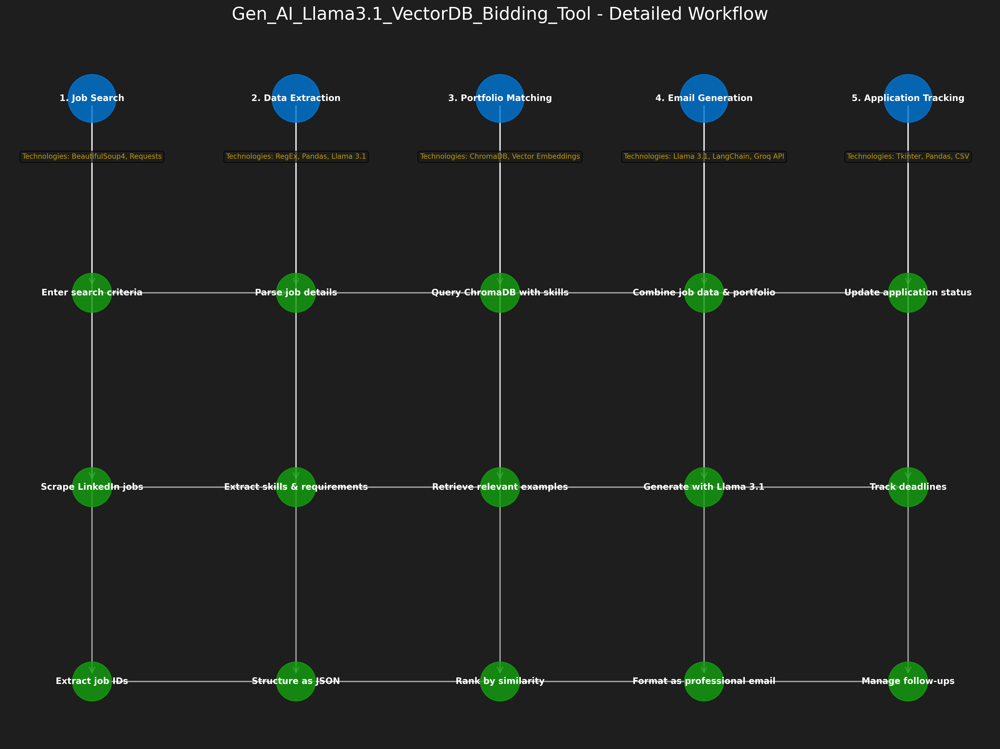

### Gen_AI_Llama3.1_VectorDB_Bidding_Tool

A comprehensive AI-powered tool for job seekers that automates LinkedIn job searching, tracking, and personalized cold email generation using Large Language Models and vector databases.


## Table of Contents

- [Overview](#overview)
- [Features](#features)
- [System Architecture](#system-architecture)
- [Technologies Used](#technologies-used)
- [Installation](#installation)
- [Usage](#usage)
- [Components](#components)
- [Workflow](#workflow)
- [Future Improvements](#future-improvements)


## Overview

The Gen_AI_Llama3.1_VectorDB_Bidding_Tool is an end-to-end solution designed to streamline the job application process. It combines web scraping, data processing, vector databases, and state-of-the-art language models to help job seekers efficiently find relevant positions, track their applications, and generate personalized cold emails to potential employers.

This tool is particularly useful for consultants and freelancers looking to bid on projects or professionals seeking new job opportunities, as it automates much of the tedious work involved in the job search and application process.

## Features

- **LinkedIn Job Scraping**: Automatically search and extract job listings from LinkedIn based on customizable criteria
- **Job Data Extraction**: Parse and structure job details including role, company, location, skills, and description
- **Application Tracking**: Manage and monitor the status of job applications through an intuitive GUI
- **Vector Database Integration**: Store and query portfolio examples using ChromaDB for semantic similarity matching
- **AI-Powered Email Generation**: Create personalized cold emails using Llama 3.1 (via Groq) that match job requirements with relevant portfolio examples
- **Dark Mode Interface**: User-friendly dark-themed GUI for comfortable use in various lighting conditions


## System Architecture

The system consists of three main components that work together:

1. **Job Tracker**: Scrapes LinkedIn for job listings, extracts structured data, and manages application status
2. **Vector Database**: Stores portfolio examples and project descriptions for semantic retrieval
3. **Cold Email Generator**: Creates personalized emails by matching job requirements with relevant portfolio examples


### Architecture




## Technologies Used

### Language Models

- **Llama 3.1 (8B Instant)**: Used via Groq API for job data extraction and email generation
- **LangChain**: Framework for composing LLM chains and prompts


### Vector Database

- **ChromaDB**: Persistent vector database for storing and retrieving portfolio examples based on semantic similarity
- **Collection Name**: "portfolio" - stores project examples with metadata including links


### Web Scraping & Data Processing

- **BeautifulSoup4**: HTML parsing and data extraction from LinkedIn
- **Requests**: HTTP library for making web requests
- **Pandas**: Data manipulation and CSV handling


### GUI Framework

- **Tkinter**: Python's standard GUI toolkit
- **Custom dark theme**: Implemented for better visibility and reduced eye strain


### Python Libraries

- **langchain_groq**: Groq API integration with LangChain
- **langchain_core**: Core LangChain components
- **langchain_community**: Community components including document loaders
- **re**: Regular expressions for text processing
- **threading**: Multi-threading for responsive GUI during API calls
- **os**: File system operations
- **json**: JSON data handling


## Installation

1. Clone the repository:


```shellscript
git clone https://github.com/whojayy/Gen_AI_Llama3.1_VectorDB_Bidding_Tool.git
cd Gen_AI_Llama3.1_VectorDB_Bidding_Tool
```

2. Create and activate a virtual environment:


```shellscript
python -m venv venv
source venv/bin/activate  # On Windows: venv\Scripts\activate
```

3. Install dependencies:


```shellscript
pip install -r requirements.txt
```

4. Set up your Groq API key:

1. Sign up at [groq.com](https://groq.com) to get an API key
2. The key will be entered in the application GUI


5. Prepare your portfolio data:

1. Create a directory for ChromaDB: `mkdir -p ~/vectorstore`
2. Add your portfolio examples to ChromaDB (see Usage section)


## Usage

### Job Tracker

1. Run the job tracker GUI:


```shellscript
python job_tracker_gui.py
```

2. In the "Search Jobs" tab:

1. Enter job title (e.g., "Python Developer")
2. Enter location (e.g., "Toronto")
3. Select job type and age filter
4. Click "Search Jobs"


3. In the "Track Applications" tab:

1. View and manage your job applications
2. Update application status
3. Access job details and links


### Cold Email Generator

1. Run the cold email generator:


```shellscript
python cold_email_gui.py
```

2. Enter your Groq API key
3. Choose input method:

1. LinkedIn URL: Paste a job listing URL and click "Fetch Job Details"
2. JSON File: Select a previously saved job_details.json file


4. Review the extracted job details
5. Click "Generate Email" to create a personalized cold email
6. Copy or save the generated email

#### JSON Format


#### Link Format


### Update Job Status (CLI)

For quick updates without the GUI:

```shellscript
python update_job_status.py
```

## Components

### 1. LinkedIn Job Tracker (`linkedin_job_tracker.py`)

This component handles:

- Searching LinkedIn for job listings based on criteria
- Extracting detailed job information
- Saving structured job data to CSV files


Key functions:

- `search_jobs()`: Collects job IDs from LinkedIn search results
- `extract_job_details()`: Parses detailed information for each job
- `save_to_csv()`: Exports job data to CSV format


### 2. Job Tracker GUI (`job_tracker_gui.py`)

A graphical interface for:

- Searching and filtering jobs
- Tracking application status
- Managing job application details


Key classes:

- `JobTrackerApp`: Main application class with search and tracking tabs


### 3. Cold Email Generator (`cold_email_gui.py`)

This component:

- Extracts job details from LinkedIn URLs or JSON files
- Queries ChromaDB for relevant portfolio examples
- Generates personalized cold emails using Llama 3.1 via Groq


Key features:

- Dark-themed UI for better visibility
- API key management
- Email generation with relevant portfolio links
- Copy and save functionality


### 4. Update Job Status (`update_job_status.py`)

A command-line utility for:

- Updating job application status
- Adding notes and application dates
- Listing jobs filtered by status


## Workflow

1. **Job Discovery**:

1. Search LinkedIn for relevant job listings
2. Extract and structure job details
3. Save to CSV for tracking


2. **Portfolio Matching**:

1. Job skills are used to query ChromaDB
2. Semantically similar portfolio examples are retrieved
3. Relevant links are collected for the email


3. **Email Generation**:

1. Job details and portfolio links are sent to Llama 3.1
2. A personalized cold email is generated highlighting relevant experience
3. The email is formatted as if from "Deep Kothari, CEO at TechVida"


4. **Application Tracking**:

1. Update application status (Applied, Interview, etc.)
2. Track deadlines and follow-ups
3. Manage application links and resume versions


## Future Improvements

- Integration with email clients for direct sending
- Automated follow-up email generation
- Sentiment analysis of job descriptions
- Resume tailoring suggestions based on job requirements
- Integration with more job boards beyond LinkedIn
- Mobile application version